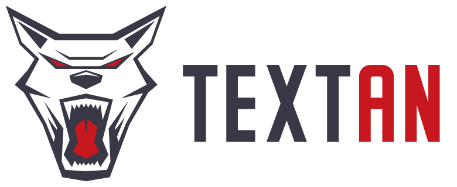

<!-- TODO: Change the logo -->

## About

In today's world, there is a large amount of unstructured written sources that
contain structured information. An example is police reports. They contain
information about entities (names, addresses, phone numbers, weapons, drugs,
etc..) and the relationships between them. For almost any automatic processing,
this information must be transformed into some representation which can be
easily read by computers. For example, it can be written into the database and
assigned to some already existing records stored in the system. This approach is
indeed used in practice but the whole process is performed manually, which is
very time consuming. Similarly, the same time-consuming processing of documents
can be found in other institutions or companies. Such problem of extracting
structure information out of general documents has recently gained attention
from both research and industry.

The topic of our software project called Text Analyser (TextAn) is to
deliver a pleasant and effective tool for extracting structured data from texts.
In many areas including our police example, the accuracy of the extracted
information is critical and thus it does not permit fully automatic extraction.
Therefore, we keep the human element involved in the process to correct and
adjust automatic results. In turn, we exploit these interventions with machine
learning techniques, so the results improve in time.

Although the first impulse indeed came from the needs of a department of the
Czech Police, TextAn is made as general as possible to allow easy 
configuration for any other domain as needed. It also is not language dependent,
so it can process texts in completely different languages if corresponding
linguistic components are provided.

TextAn is a client-server application for text analysis. It provides
webservice interfaces, so it is easy to implement a custom client to meet
specific user needs or to integrate it in a legacy system. The project
consists of two main contributions. Firstly, the server integrating named entity
recognition and object assigning provides interface to access the database and
these components. Secondly, the client offers a friendly method for users to
confirm or adjust the system's suggestions and explore the data stored in the
database.

TextAn is implemented in Java 8 and it is platform independent except for
some third party libraries that are attached only for some platforms. However
they are open source and can be compiled for any operating system desired. The
data can be stored within any SQL-like relation database, e.g. MySQL which
is supported out-of-the-box.
